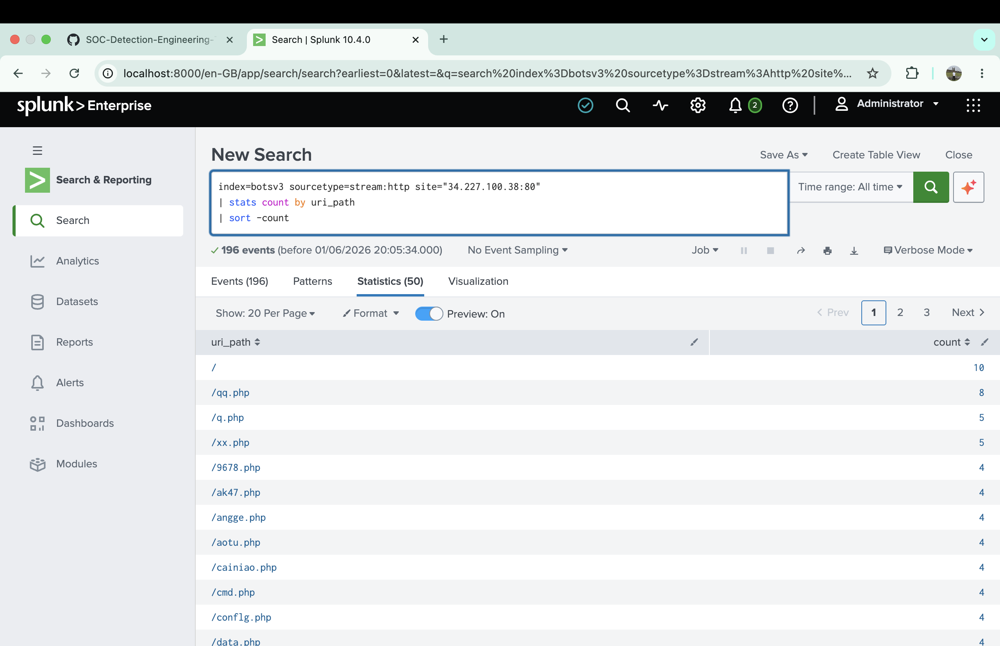
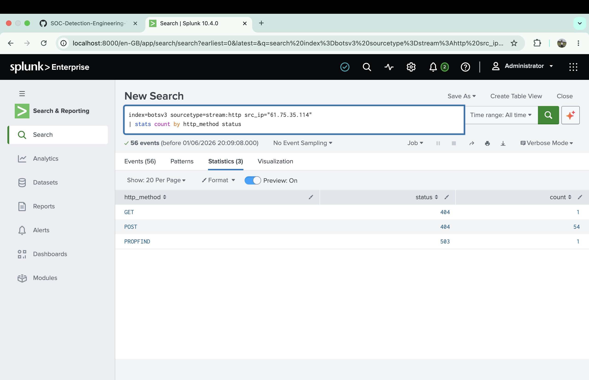

# Investigation 01 – Suspicious Web-Shell Probing Activity

## Overview

This investigation analyzed suspicious HTTP activity identified within the BOTS v3 dataset. Multiple external source IP addresses were observed sending HTTP requests to an AWS EC2-hosted web server.

The objective was to determine whether the activity represented normal web traffic, automated scanning, or an attempted compromise.

---

## Detection

Analysis of HTTP traffic identified repeated requests targeting PHP files commonly associated with web shells and backdoors.

Examples included:

* cmd.php
* ak47.php
* qq.php
* db.init.php

The requests originated from multiple external IP addresses and targeted a public-facing web server.

---

## Investigation

The primary source IP address identified during the investigation was:

```text
61.75.35.114
```

The targeted server was:

```text
Public IP: 34.227.100.38
Internal IP: 172.16.0.109
Host: ip-172-16-0-109.ec2.internal
```

Analysis revealed repeated HTTP POST requests to suspicious PHP filenames. An additional PROPFIND request targeting a WebDAV path was also observed.

---

## Evidence

### Web-Shell Probing Activity



The source IP repeatedly attempted to access PHP files commonly associated with web shells and publicly available scanner wordlists.

### HTTP Method Analysis



The majority of requests were HTTP POST requests. All observed requests returned HTTP 404 responses, indicating the requested resources were not present on the server.

---

## Findings

Observed activity is consistent with automated web application reconnaissance.

A remote host (61.75.35.114) performed repeated HTTP POST requests against an EC2-hosted web server (34.227.100.38 / 172.16.0.109).

The requests targeted numerous PHP filenames commonly associated with web shells, backdoors, or publicly available scanner wordlists.

Examples included:

* cmd.php
* ak47.php
* qq.php
* db.init.php

The attacker also issued a PROPFIND request against a WebDAV path.

All observed requests resulted in HTTP 404 responses, indicating the requested resources were not present on the server.

No evidence of successful compromise was identified during this investigation.

---

## MITRE ATT&CK Mapping

| Tactic         | Technique                                 |
| -------------- | ----------------------------------------- |
| Reconnaissance | T1595 - Active Scanning                   |
| Initial Access | T1190 - Exploit Public-Facing Application |

---

## Analyst Assessment

**Confidence Level:** Medium-High

The observed activity is assessed as automated web-shell discovery and web application reconnaissance. The evidence suggests scanning behavior rather than successful exploitation. No indicators of compromise were identified during this investigation.

