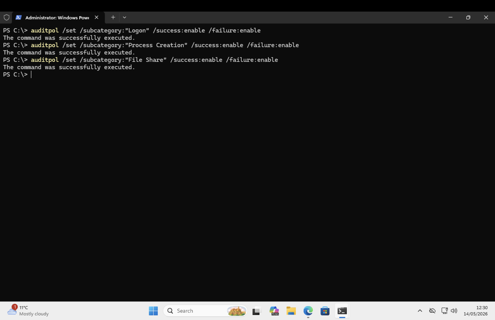
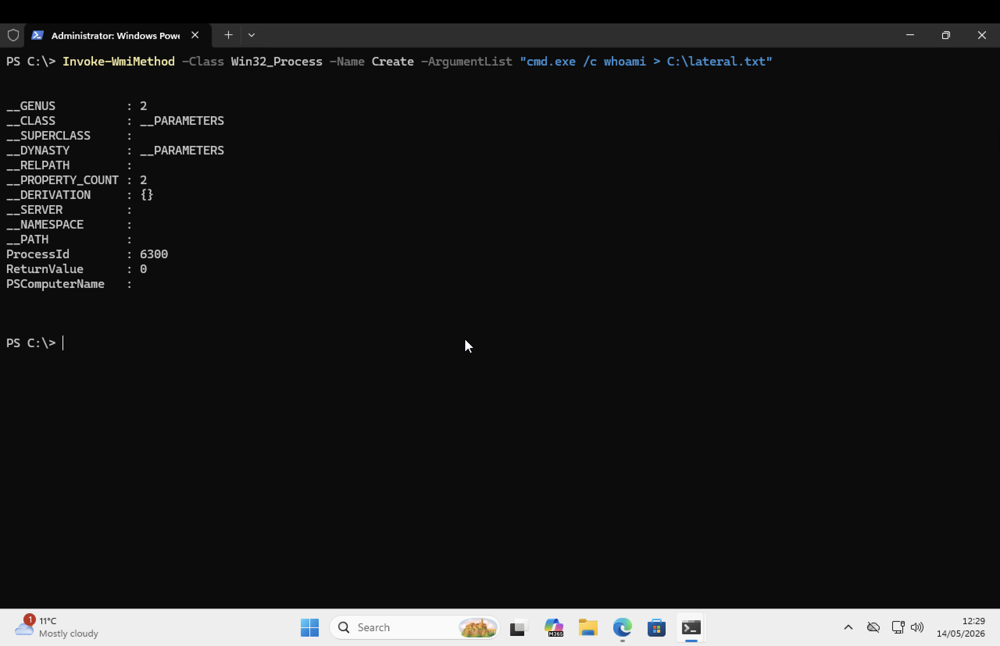
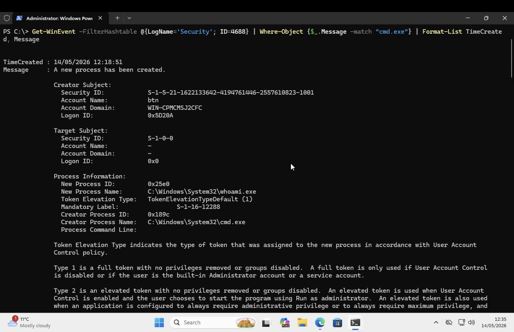
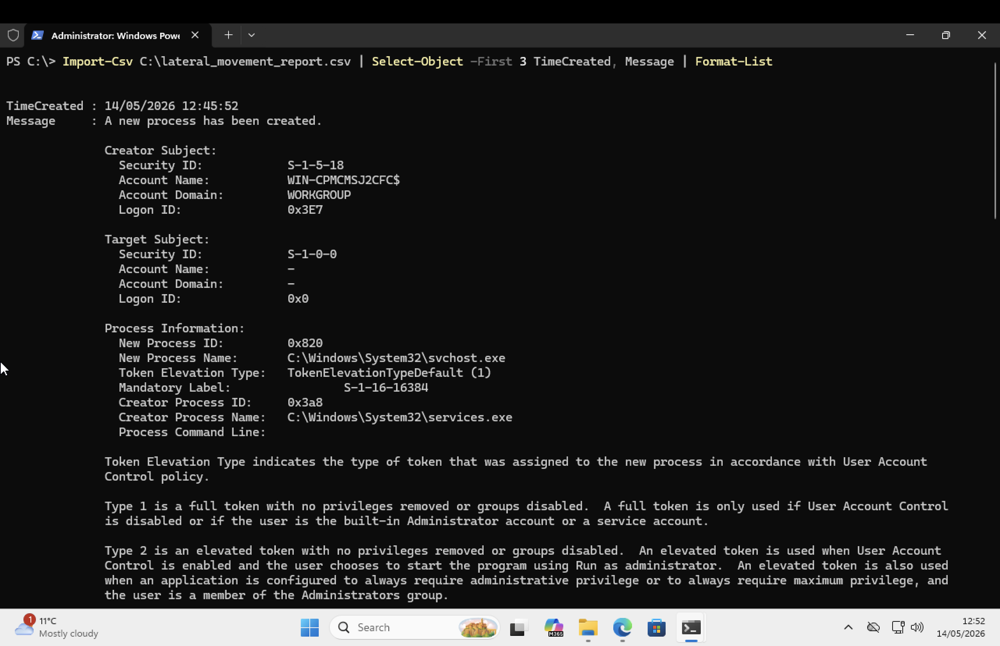
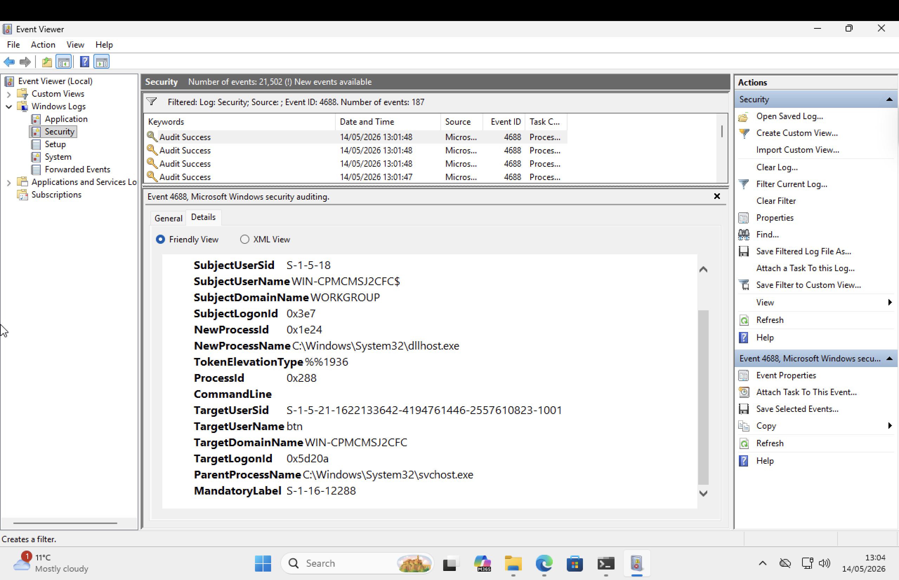
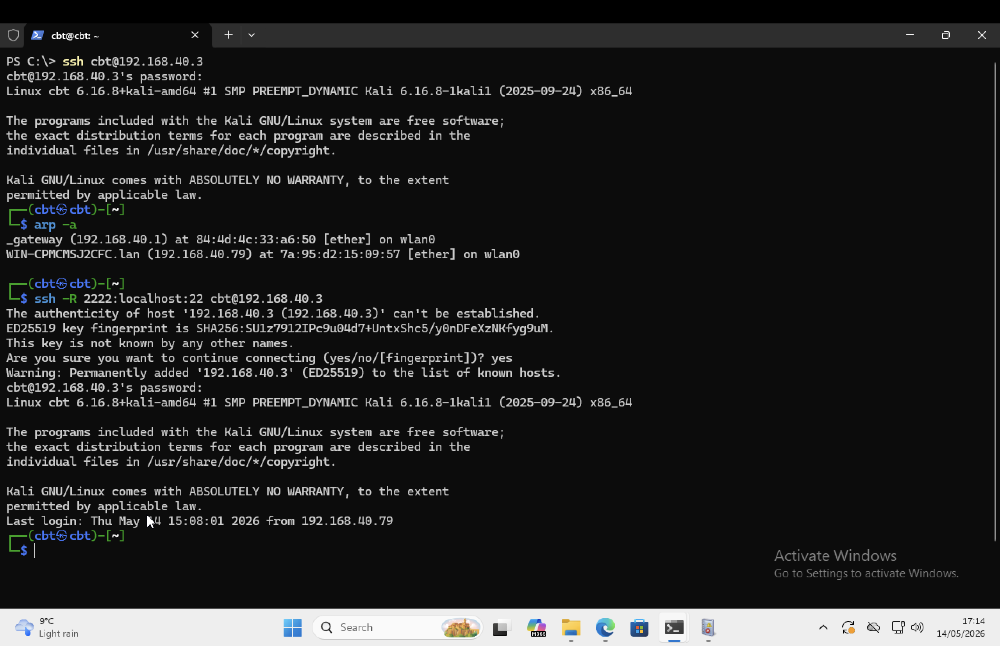
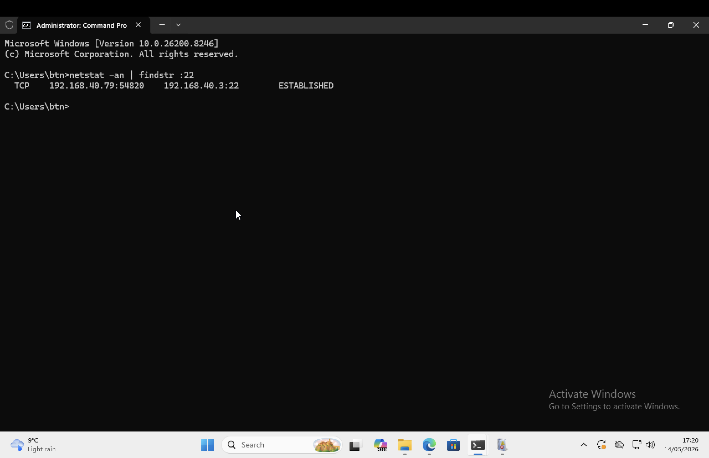
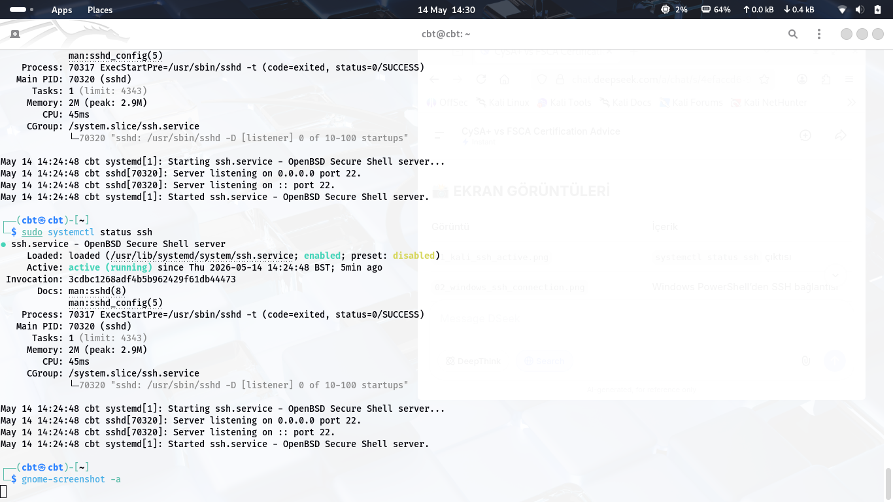
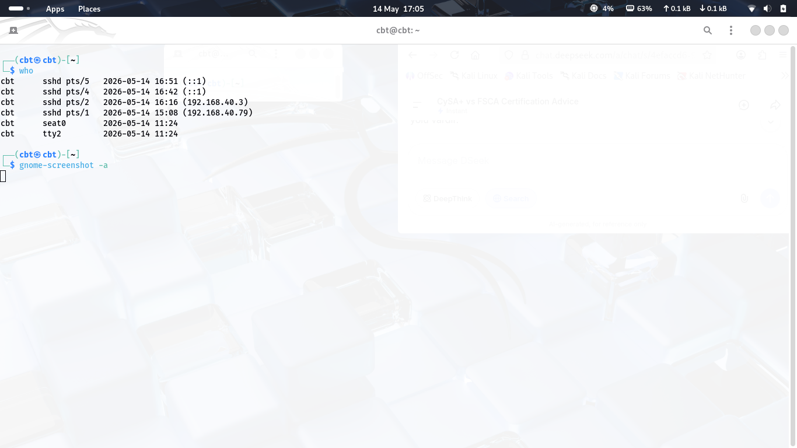

# Lateral Movement Investigation – Windows to Kali SSH Activity

## Overview

This project documents an Incident Response investigation into simulated lateral movement activity between a Windows host and a Kali Linux host.

The investigation focuses on identifying remote execution activity, validating Windows Event Log evidence, reviewing SSH activity, and assessing whether a reverse tunnel attempt succeeded.

The objective is to demonstrate how defenders can detect, investigate, and validate lateral movement techniques using Windows telemetry, Linux logs, and network evidence.

---

## Scenario

A Windows host was used to execute commands through WMI and establish connectivity with a Kali Linux host.

Windows Security Event ID 4688 was used to validate process execution activity, while SSH session evidence on Kali was used to confirm successful remote access.

A reverse SSH tunnel was subsequently attempted from Kali back to Windows to simulate attacker persistence techniques.

The reverse tunnel failed because Windows SSH password authentication was disabled.

This project demonstrates both attacker tradecraft and defensive configuration validation.

---

## Investigation Workflow

```text
Remote Access Observed
      ↓
Audit Policy Enabled
      ↓
Remote Command Executed
      ↓
Windows Event ID 4688 Reviewed
      ↓
SSH Activity Validated
      ↓
Reverse Tunnel Attempt Reviewed
      ↓
Defensive Control Confirmed
      ↓
Incident Response Assessment
```

---

## Evidence Collected

## Evidence Collected

### 01 – Audit Policy Configuration

Audit policies were enabled to capture authentication, process creation, and file share activity.



---

### 02 – WMI Remote Command Execution

A remote command was executed using WMI process creation.



---

### 03 – Event ID 4688 Evidence

Windows Security Event ID 4688 confirmed process creation activity.



---

### 04 – Exported Investigation Report

CSV report generated from collected Windows Event Log evidence.



---

### 05 – Event Viewer Validation

Manual validation of Event ID 4688 within Windows Event Viewer.



---

### 06 – Reverse SSH Tunnel Attempt

Reverse tunnel attempt from Kali Linux to Windows.



---

### 07 – Network Connection Validation

Windows netstat output showing active SSH connectivity.



---

### 08 – Kali SSH Service Status

Verification that the SSH service was running on Kali Linux.



---

### 09 – Connected User Sessions

Kali Linux who command showing active SSH sessions from Windows.



---

## Detection Opportunities

The following telemetry sources were useful during the investigation:

* Windows Security Event ID 4688
* PowerShell Logs
* WMI Activity
* SSH Authentication Logs
* Network Connection Monitoring
* Process Creation Telemetry

These data sources provide valuable visibility into lateral movement activity and remote execution techniques.

---

## Key Findings

### 1. Remote Command Execution

A command was executed remotely using WMI:

```text
Invoke-WmiMethod -Class Win32_Process -Name Create
```

This created process execution evidence on the Windows host.

The activity demonstrated how WMI can be used to execute commands remotely without direct interactive access.

---

### 2. Windows Event Log Evidence

Windows Security Event ID 4688 was used to validate process creation activity.

Event ID 4688 provided evidence of:

* Process creation
* Creator process context
* Target process details
* User context
* Host context

This telemetry allowed the activity to be reconstructed during investigation.

---

### 3. SSH-Based Lateral Movement

SSH activity confirmed successful connectivity between Windows and Kali.

Evidence included:

* Active SSH sessions
* Network connection validation
* Kali SSH service logs
* User session verification

Kali's who output confirmed that the Windows host successfully connected to the Kali system.

---

### 4. Reverse Tunnel Attempt

A reverse SSH tunnel was attempted from Kali back to Windows.

Example:

```text
ssh -R 2222:localhost:22 user@windows-host
```

The objective was to simulate attacker persistence and remote access techniques.

The tunnel attempt failed because password authentication was disabled on the Windows SSH server.

---

## Defensive Control Validation

The following SSH configuration was validated:

```text
PasswordAuthentication no
```

This setting blocks password-based SSH authentication.

As a result:

* Reverse tunnel creation failed
* Password-based access was prevented
* Persistence opportunities were reduced

This demonstrates the importance of secure SSH configuration as a defensive control.

---

## MITRE ATT&CK Mapping

| Technique                          | ID        |
| ---------------------------------- | --------- |
| Remote Services                    | T1021     |
| Windows Management Instrumentation | T1047     |
| Protocol Tunneling                 | T1572     |
| PowerShell                         | T1059.001 |

---

## Incident Response Assessment

The investigation confirmed successful remote activity between Windows and Kali systems and collected supporting evidence from Windows Event Logs, SSH activity, and network telemetry.

Windows Event ID 4688 provided evidence of process creation associated with the simulated activity.

SSH session evidence confirmed successful remote connectivity.

Although a reverse SSH tunnel was attempted, the connection failed due to secure SSH configuration on the Windows host.

The investigation demonstrated the effectiveness of Windows Event Logging, SSH monitoring, and defensive configuration validation during lateral movement investigations.

---

## Analyst Decision

Risk Level: Medium

Reason:

* Remote execution observed
* WMI activity confirmed
* Event ID 4688 evidence collected
* SSH connectivity confirmed
* Reverse tunnel attempt detected
* Persistence was not established
* Defensive controls successfully blocked password-based SSH access

The activity warranted investigation but did not result in successful persistence.

---

## Skills Demonstrated

* Incident Response
* Lateral Movement Investigation
* Windows Event Log Analysis
* Event ID 4688 Analysis
* WMI Investigation
* SSH Activity Review
* Network Analysis
* Defensive Control Validation
* MITRE ATT&CK Mapping
* Security Operations

---

## Technologies Used

* Windows
* Kali Linux
* PowerShell
* WMI
* OpenSSH
* Windows Event Viewer
* Security Event Logs

---

## Key Lesson

> Lateral movement detection requires correlating endpoint telemetry, authentication activity, process creation logs, and network session evidence.

This investigation demonstrated how Windows Event ID 4688, SSH session validation, and defensive configuration review can be combined to identify and assess lateral movement activity.

Successful incident response depends on visibility, evidence correlation, and understanding attacker tradecraft.
