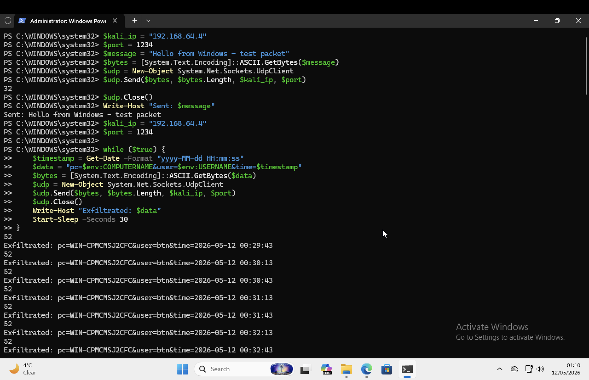
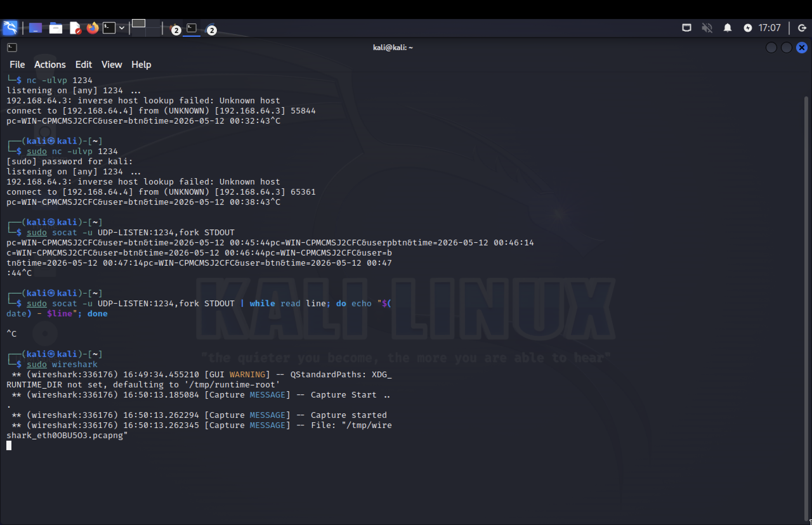
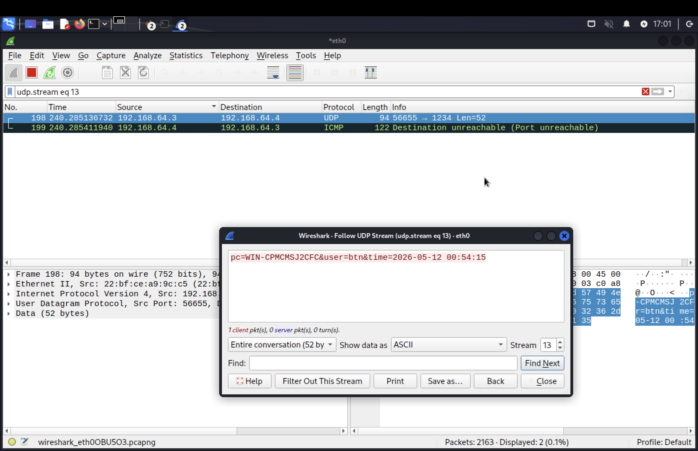

# Incident Response Investigation 03 – Low and Slow UDP Exfiltration

## Overview

This investigation documents a simulated low-frequency UDP-based data exfiltration scenario between a Windows endpoint and a Kali Linux system.

The objective was to evaluate how low-volume network communications can be used to transfer information while generating minimal network noise and to demonstrate how such activity can be identified through incident response investigation techniques.

The investigation combines PowerShell execution analysis, network traffic validation, packet inspection, and MITRE ATT&CK mapping.

---

## Scenario

A PowerShell script was executed on a Windows endpoint to periodically transmit system information to a Kali Linux host using UDP.

The transmitted information included:

* Computer Name
* Username
* Timestamp

Messages were intentionally sent every 30 seconds to simulate a low and slow exfiltration technique designed to avoid detection through simple traffic volume monitoring.

A Kali Linux listener was configured to receive and display transmitted data.

---

## Investigation Workflow

```text
PowerShell Script Executed
            ↓
UDP Communication Established
            ↓
Kali Listener Received Data
            ↓
Packet Capture Validation
            ↓
Evidence Collection
            ↓
MITRE ATT&CK Mapping
            ↓
Incident Response Assessment
```

---

## Evidence Collected

| Screenshot                      | Description                                        |
| ------------------------------- | -------------------------------------------------- |
| 01-kali-udp-listener.png        | Kali Linux UDP listener receiving transmitted data |
| 02-windows-udp-exfiltration.png | PowerShell script generating UDP traffic           |
| 03-wireshark-udp-capture.png    | Wireshark validation of transmitted UDP content    |

---

## Endpoint Activity Analysis

The investigation identified a PowerShell script responsible for generating UDP traffic from the Windows endpoint.

The script collected basic host information and transmitted the data to a remote UDP listener.

Example transmitted data:

```text
pc=WINDOWS-HOST
user=Administrator
time=2026-06-05 01:15:22
```

### PowerShell Execution Evidence



The activity generated recurring outbound UDP traffic at 30-second intervals.

---

## Network Communication Validation

A Kali Linux system was configured as a UDP listener using socat.

```bash
sudo socat -u UDP-LISTEN:1234,fork STDOUT
```

Received messages confirmed successful communication between the Windows endpoint and the Kali Linux system.

### Listener Evidence



The received messages contained the hostname, username, and timestamp collected from the Windows endpoint.

---

## Packet Inspection Analysis

Wireshark was used to validate network traffic and inspect transmitted UDP packet contents.

Analysis confirmed that the transmitted data was visible within network traffic and could be reconstructed through packet inspection.

### Wireshark Evidence



The packet capture validated successful UDP communication and confirmed the presence of transmitted system information.

---

## Key Findings

### Low Frequency Communication

Traffic was intentionally limited to one transmission every 30 seconds, reducing visibility when compared to high-volume exfiltration activity.

### Successful Data Transfer

The Windows endpoint successfully transmitted information to the Kali Linux host using UDP.

### Network Evidence Available

Although the traffic volume was low, packet inspection clearly identified transmitted data and communication patterns.

### Endpoint and Network Correlation

The investigation successfully correlated PowerShell execution activity with observed network traffic.

---

## MITRE ATT&CK Mapping

| Tactic              | Technique                              | ID        |
| ------------------- | -------------------------------------- | --------- |
| Exfiltration        | Exfiltration Over Alternative Protocol | T1048     |
| Command and Control | Application Layer Protocol             | T1071     |
| Execution           | PowerShell                             | T1059.001 |

---

## Incident Response Assessment

The investigation confirmed successful low-frequency UDP-based data transmission from a Windows endpoint to a Kali Linux host.

The activity generated minimal network traffic and demonstrated how attackers may attempt to conceal exfiltration activity through low-volume communications.

Evidence collected from PowerShell execution, network monitoring, and packet inspection provided sufficient visibility to identify and validate the activity.

---

## Skills Demonstrated

* Incident Response
* Data Exfiltration Investigation
* Network Traffic Analysis
* Wireshark Packet Inspection
* PowerShell Analysis
* Endpoint and Network Correlation
* Evidence Collection
* MITRE ATT&CK Mapping
* Security Monitoring

---

## Key Lesson

> Low and slow activity is often more difficult to detect than high-volume attacks.

This investigation demonstrated the importance of correlating endpoint telemetry, script execution activity, and network evidence when investigating potential data exfiltration events.
