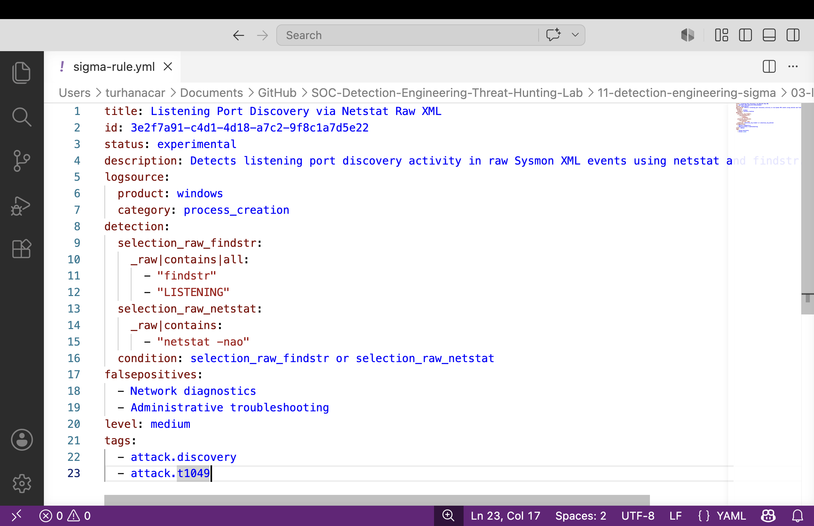
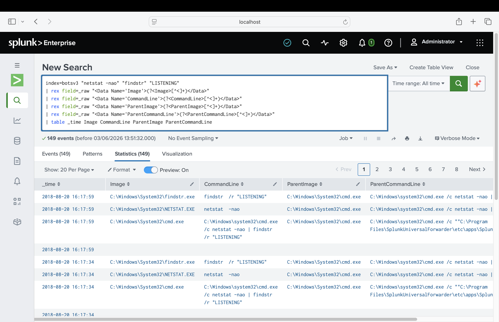

# Detection 03 – Listening Port Discovery

## Overview

This detection engineering project focuses on identifying network reconnaissance activity through listening port enumeration using `netstat` and `findstr`.

Attackers frequently enumerate active network connections and listening services after gaining access to a system. This information helps identify exposed services, potential lateral movement paths, and additional attack opportunities within the environment.

The detection was developed after identifying repeated use of `netstat -nao` combined with `findstr /r "LISTENING"` within the BOTSv3 dataset.

---

## Detection Objective

Detect processes performing listening port discovery through:

```text
netstat -nao
findstr /r "LISTENING"
```

This activity may indicate:

* Network reconnaissance
* Internal discovery
* Service enumeration
* Post-exploitation investigation
* Lateral movement preparation

---

## Why This Detection Was Created

During threat hunting activities within the BOTSv3 dataset, multiple process creation events were identified involving:

```text
cmd.exe /c netstat -nao | findstr /r "LISTENING"
```

and:

```text
findstr.exe
```

searching specifically for:

```text
LISTENING
```

This behavior is commonly associated with attackers attempting to identify listening services and open ports on a compromised system.

One example event contained:

```text
Image:
C:\Windows\System32\findstr.exe

CommandLine:
findstr /r "LISTENING"

ParentImage:
C:\Windows\System32\cmd.exe

ParentCommandLine:
cmd.exe /c netstat -nao | findstr /r "LISTENING"
```

---

## Sigma Detection Logic

The Sigma rule was designed to identify listening port enumeration activity using common Windows discovery utilities.

### Sigma Rule

See:

```text
sigma-rule.yml
```
## Sigma Rule Development

The Sigma rule was created to identify listening port discovery activity that may indicate reconnaissance or unauthorized network service exposure.

### Evidence


### Sigma ATT&CK Tags

| Sigma Tag        | MITRE ATT&CK Mapping                 |
| ---------------- | ------------------------------------ |
| attack.discovery | Discovery                            |
| attack.t1049     | System Network Connections Discovery |

---

## PySigma Conversion

The Sigma rule was converted into Splunk SPL using PySigma.

Generated SPL:

```spl
(Image="*\\findstr.exe" CommandLine="*LISTENING*") OR CommandLine="*netstat -nao*"
```


## Detection Validation

The detection logic was validated against available telemetry to confirm accurate identification of listening port discovery behaviour.

### Evidence


### Initial Threat Hunting Results

A broad threat hunting search identified:

```text
452 Events
```

using:

```spl
index=botsv3 ("LISTENING" OR "netstat -nao")
```

This search provided initial evidence that listening port discovery activity existed within the dataset.

---

### Sigma Validation

The generated PySigma query did not directly return results because BOTSv3 stores Sysmon process creation data inside XML event fields rather than automatically extracted Splunk fields.

This required additional tuning and validation.

---

### Tuned Validation Search

The detection was refined using a more specific search:

```spl
index=botsv3 "netstat -nao" "findstr" "LISTENING"
| rex field=_raw "<Data Name='Image'>(?<Image>[^<]+)</Data>"
| rex field=_raw "<Data Name='CommandLine'>(?<CommandLine>[^<]+)</Data>"
| rex field=_raw "<Data Name='ParentImage'>(?<ParentImage>[^<]+)</Data>"
| rex field=_raw "<Data Name='ParentCommandLine'>(?<ParentCommandLine>[^<]+)</Data>"
| table _time Image CommandLine ParentImage ParentCommandLine
```

### Validation Results

The tuned detection successfully identified:

```text
149 Events
```

This reduced noise while focusing specifically on listening port enumeration activity.

---

## Detection Results

Observed activity included:

* Netstat execution
* Listening port enumeration
* Network service discovery
* Command shell execution
* Parent-child process relationships
* Discovery phase attacker behavior

The detection successfully identified reconnaissance activity that would warrant investigation within a production SOC environment.

---

## MITRE ATT&CK Mapping

| Tactic    | Technique | Description                          |
| --------- | --------- | ------------------------------------ |
| Discovery | T1049     | System Network Connections Discovery |

### ATT&CK Interpretation

The observed command chain:

```text
cmd.exe
        ↓
netstat -nao
        ↓
findstr "LISTENING"
```

demonstrates an attacker or administrator attempting to enumerate active listening services on a system.

This technique is commonly used during internal reconnaissance and post-exploitation activities to identify services that may be targeted for further attack.

---

## Detection Engineering Workflow

```text
Threat Hunting Activity
                ↓
452 Discovery Events Identified
                ↓
Suspicious Enumeration Behavior Confirmed
                ↓
Sigma Rule Created
                ↓
PySigma Conversion
                ↓
Splunk Validation
                ↓
Field Extraction Challenge Identified
                ↓
Detection Tuned
                ↓
149 High-Fidelity Events Identified
```

---

## Analyst Assessment

This project demonstrates how Detection Engineering begins with threat hunting and evolves into a reusable detection capability.

The investigation identified repeated use of `netstat` and `findstr` to enumerate listening services within the environment. After confirming the activity through threat hunting, a Sigma rule was developed to create a portable detection that could be reused across multiple SIEM platforms.

The project also demonstrates a realistic detection engineering challenge where generated Sigma detections required tuning to account for the underlying data structure of the BOTSv3 dataset.

This detection successfully identified listening port discovery activity and demonstrates practical Detection Engineering, threat hunting, Splunk validation, ATT&CK mapping, and detection tuning techniques used by SOC analysts and Detection Engineers.
