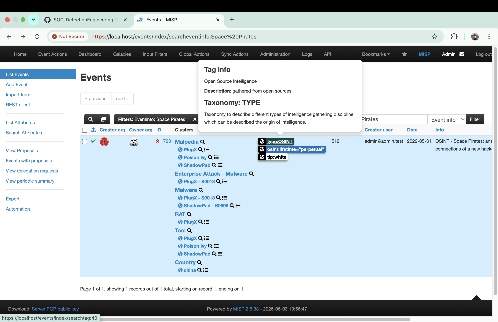
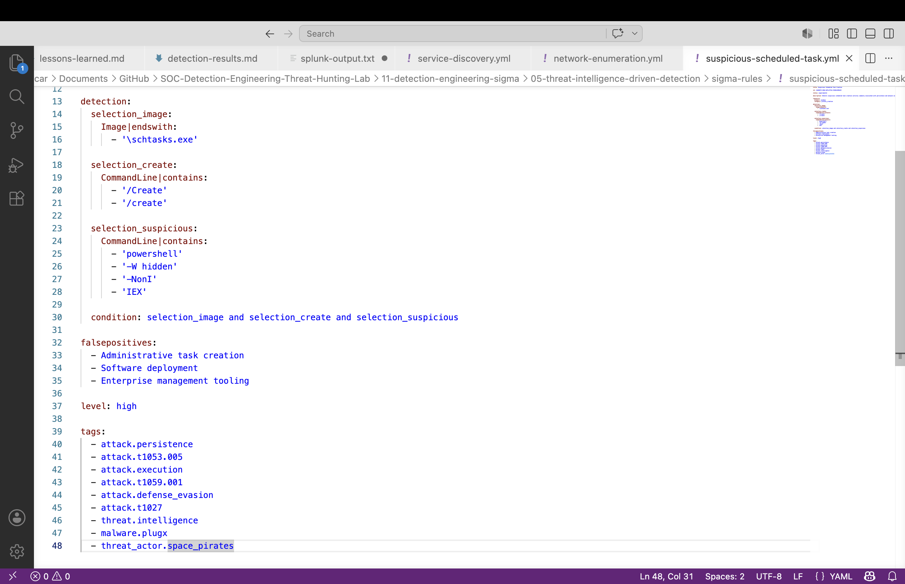
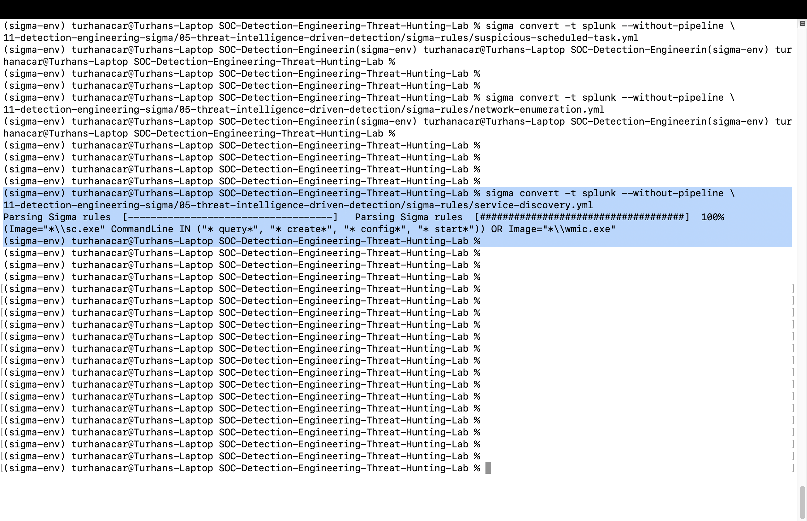
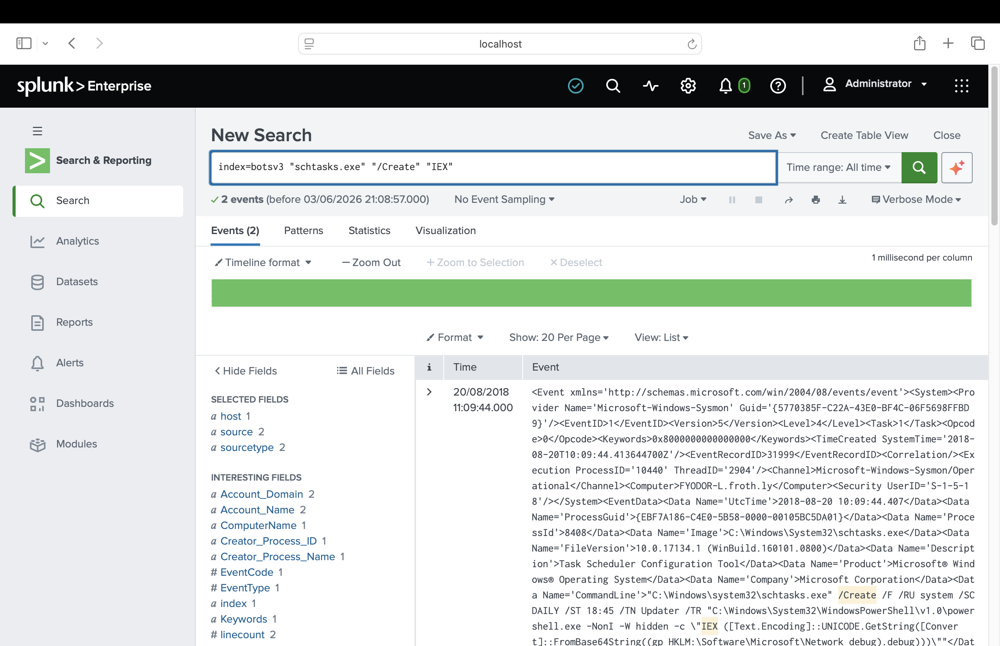

# Threat Intelligence Driven Detection Engineering

## Overview

This project demonstrates how threat intelligence can be transformed into actionable detection content through behavioral detection engineering.

The project uses intelligence associated with the Space Pirates threat actor and PlugX Remote Access Trojan (RAT) to identify attacker behaviors, map them to MITRE ATT&CK techniques, develop Sigma rules, convert those rules into Splunk SPL using PySigma, and validate detections against laboratory telemetry.

Rather than focusing solely on indicators of compromise such as hashes, domains, or IP addresses, this project emphasizes behavioral detections that remain effective even when attacker infrastructure changes.

## Threat Intelligence Analysis

The investigation began with threat intelligence analysis to identify indicators and attacker behaviour relevant to the detection objective.

### Evidence




# Threat Intelligence Source

The intelligence used during this project originated from a published MISP event:

```text
1723 - OSINT - Space Pirates: analyzing the tools and connections of a new hacker group
```

Threat Level:

```text
High
```

Analysis Status:

```text
Completed
```

Published:

```text
Yes
```

Threat intelligence analysis identified the use of PlugX RAT, a remote access trojan capable of:

* Remote command execution
* Service manipulation
* Process management
* Registry modification
* Network discovery
* System discovery
* Keylogging
* Screen capture

These behaviors formed the basis for the detections developed throughout this project.

---

# Detection Engineering Philosophy

One of the most important lessons learned during this investigation was:

> Hashes change. IPs change. Domains change. Behaviors persist.

Threat actors frequently rotate infrastructure and modify malware samples.

As a result, detections based solely on indicators often become obsolete.

Behavioral detections provide longer-term value because they focus on attacker actions rather than attacker artifacts.

---

# Detection Engineering Workflow

The following methodology was used:

```text
Threat Intelligence
        ↓
Adversary Analysis
        ↓
MITRE ATT&CK Mapping
        ↓
Behavior Identification
        ↓
Sigma Rule Development
        ↓
PySigma Conversion
        ↓
Splunk Validation
        ↓
Detection Tuning
```

This mirrors workflows commonly used by Detection Engineers, Threat Hunters, and SOC Analysts.

---

# MITRE ATT&CK Mapping

| ATT&CK ID | Technique                            |
| --------- | ------------------------------------ |
| T1059.001 | PowerShell                           |
| T1053.005 | Scheduled Task                       |
| T1046     | Network Service Discovery            |
| T1049     | System Network Connections Discovery |
| T1018     | Remote System Discovery              |
| T1543.003 | Windows Service                      |
| T1027     | Obfuscated Files or Information      |

---

# Sigma Detections Developed

## 1. Encoded PowerShell Execution

Detection of PowerShell commands using:

```text
-enc
-encodedcommand
```

ATT&CK:

```text
T1059.001
T1027
```

## Sigma Rule Development

A Sigma rule was developed to detect the identified behaviour and provide a portable detection format.

### Evidence




## 2. Scheduled Task Persistence

Detection of suspicious task creation using:

```text
powershell.exe
        ↓
schtasks.exe
        ↓
/Create
```

ATT&CK:

```text
T1053.005
```

---

## 3. Network Enumeration

Detection of reconnaissance activity using:

```text
netstat
findstr
LISTENING
```

and IP range discovery activity.

ATT&CK:

```text
T1046
T1049
T1018
```

---

## 4. Service Discovery and Manipulation

Detection of:

```text
sc.exe
wmic.exe
```

performing:

```text
query
create
config
start
```

operations.

ATT&CK:

```text
T1543.003
T1047
```

---

# PySigma Conversion

All Sigma rules were converted into Splunk SPL using PySigma.

Example:

```bash
sigma convert -t splunk --without-pipeline rule.yml
```

The `--without-pipeline` option was used to observe raw Sigma-to-Splunk translation without field mapping transformations.

This allowed direct validation of detection logic and SPL generation.


## PySigma Conversion

The Sigma rule was converted into Splunk SPL using PySigma to support validation within the SIEM environment.

### Evidence


# Detection Validation

Each Sigma rule was converted and validated against available BOTSv3 telemetry.

The converted detection was validated against available telemetry to confirm effectiveness and expected alert generation.

### Evidence


The validation process demonstrated that:

* Sigma rules can be translated into Splunk SPL
* Generated detections require validation against real telemetry
* Detection tuning may be required when fields are stored within raw XML structures
* Behavioral detections are often more resilient than IOC-based detections

---

# Key Lessons Learned

* Threat intelligence is most valuable when transformed into detection content.
* Behavioral detections are more durable than IOC-only detections.
* Sigma provides a portable, vendor-neutral detection format.
* PySigma simplifies SIEM translation.
* Validation is essential before deploying detections.
* ATT&CK mapping improves detection coverage and reporting.

---

# Conclusion

This project demonstrates how threat intelligence can be operationalized into practical detection engineering workflows.

By combining threat intelligence analysis, MITRE ATT&CK mapping, Sigma rule development, PySigma conversion, and Splunk validation, the project transforms intelligence into reusable detection content suitable for SOC monitoring, threat hunting, and detection engineering programs.

The resulting methodology provides a repeatable framework for converting intelligence about adversary behavior into actionable security detections.
