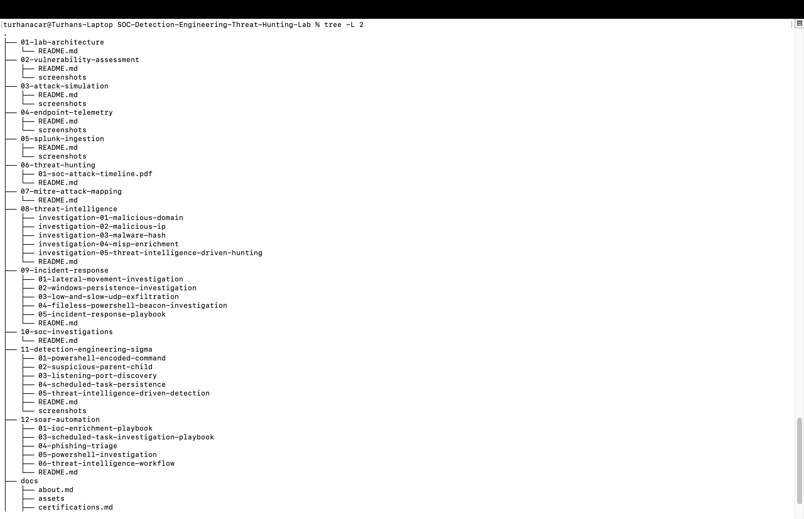

[Home](index.md) | [About](about.md) | [Certifications](certifications.md) | [Projects](projects.md) | [Contact](contact.md)

# SOC Project Portfolio

This portfolio documents the development of a complete SOC Detection Engineering, Threat Hunting, Incident Response, Threat Intelligence, and SOAR Automation lab environment.

# SOC Project Portfolio

This portfolio documents the development of a complete SOC Detection Engineering, Threat Hunting, Incident Response, Threat Intelligence, and SOAR Automation lab environment.

## Repository Structure

# Core Technologies

* Splunk Enterprise
* Sysmon
* Windows 7
* Windows 11
* Kali Linux
* Nessus
* Docker
* Docker Compose
* MISP
* Sigma
* PySigma
* PowerShell
* Python
* Wireshark
* MITRE ATT&CK
* BOTSv3 Dataset
* Threat Intelligence Analysis
* Detection Engineering
* Incident Response
* SOAR Automation

# 01 - Lab Architecture

Design and implementation of the lab environment including Splunk, Windows, Kali Linux, and supporting security tools.

# 02 - Vulnerability Assessment

Vulnerability assessment activities using Nessus.

Projects include:

* Vulnerability discovery
* Risk analysis
* Remediation recommendations
* Security assessment reporting

# 03 - Attack Simulation

Controlled attack simulations used to generate telemetry and investigative artifacts.

Projects include:

* SMB Enumeration
* Network Reconnaissance
* PowerShell Execution
* Remote Execution Simulation

# 04 - Endpoint Telemetry

Endpoint visibility using Sysmon.

Projects include:

* Sysmon deployment
* Sysmon configuration
* Event analysis
* Process monitoring

# 05 - Splunk Ingestion

Data onboarding and log management using Splunk Enterprise.

Projects include:

* Universal Forwarder deployment
* Index configuration
* Data validation
* Search optimization

# 06 - Threat Hunting

Threat hunting investigations using BOTSv3 and Sysmon telemetry.

Projects include:

* Process analysis
* Parent-child investigation
* PowerShell hunting
* Network activity analysis
* Attack timeline reconstruction

# 07 - MITRE ATT&CK Mapping

Mapping observed attacker behaviors to MITRE ATT&CK techniques and tactics.

Projects include:

* ATT&CK mapping
* Detection coverage analysis
* Technique documentation

# 08 - Threat Intelligence

Threat intelligence enrichment and IOC-based investigations.

Projects include:

* Malicious domain analysis
* Malicious IP analysis
* Malware hash investigation
* MISP enrichment
* Threat intelligence driven hunting

# 09 - Incident Response

Hands-on Incident Response investigations focused on attacker behaviour validation, evidence collection, log analysis, and MITRE ATT&CK mapping.

Projects include:

* Lateral Movement Investigation
* Windows Persistence Investigation
* Low and Slow UDP Exfiltration
* Fileless PowerShell Beacon Investigation
* Incident Response Playbook

Projects include:

* WMI Execution Analysis
* Event ID 4688 Investigation
* Event ID 4104 Analysis
* Registry Persistence Detection
* PowerShell Analysis
* SSH Activity Validation
* Reverse Tunnel Assessment
* UDP Traffic Analysis
* Wireshark Packet Validation
* Command and Control Detection
* Evidence Collection
* Incident Response Procedures
* MITRE ATT&CK Mapping

# 10 - SOC Investigations

End-to-end SOC investigations combining telemetry, threat intelligence, and analyst workflows.

# 11 - Detection Engineering with Sigma

Development, conversion, validation, and tuning of Sigma detection rules using real telemetry, threat hunting findings, and threat intelligence analysis.

Projects include:

* PowerShell Encoded Command Detection
* Suspicious Parent-Child Process Detection
* Network Discovery Detection
* Scheduled Task Persistence Detection
* Threat Intelligence Driven Detection
* Sigma Rule Development
* PySigma Conversion
* Splunk Detection Validation
* Detection Tuning
* MITRE ATT&CK Mapping
* Behavioral Detection Engineering

# 12 - SOAR Automation

Security Orchestration, Automation, and Response workflows designed to automate investigation and enrichment activities.

Projects include:

* IOC Enrichment Playbook
* MISP Threat Intelligence Integration
* Malware Hash Automation
* Threat Intelligence Enrichment
* Investigation Automation
* Python-Based Security Automation

---

